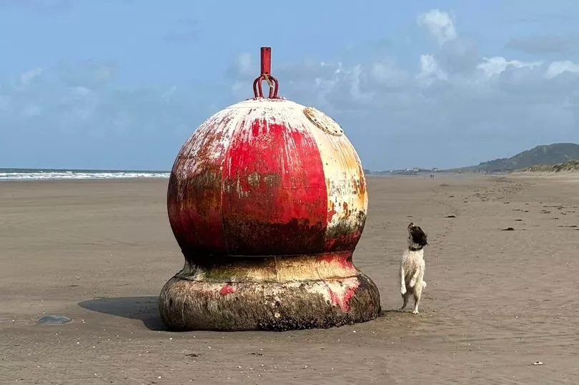

# jeju-house

## Jeju house

### Introduction

[https://github.com/vietphan1995/jeju-house](https://github.com/vietphan1995/jeju-house)

✉️ [Send to email: vietphan95@outlook.com](mailto:vietphan95@outlook.com?subject=register_idea:jeju-house_project&body=left_your_idea)

A house that people can live in emergency situation. Emergency situation can be listed as natural disaster like storm, volcano, flood, rain, earthquake, fired; happen on land, sand, mountain, beach, ocean, or in attack by animal …

This house has architect shape like warning float on beach, circle shape, triangle ridge, and long bottom column nail connect with this house below water face, i think this house can keep balance when it meets big waves, winds, volcanos, in any temperature condition.

This house can save people in a time range when they have accident, incident in any terrain.

This house can act as lighthouse in beach. This lighthouse act as station send and receive signal from all vehicles, specific devices. A network of jeju house can transfer signal communication in any terrain, it can help save and reduce accidents, incidents of ships, planes on ocean also complexity terrains.

In extend, this house can help maintain ocean life in observe animal method, clean waste trash in the ocean; history, accident, incident research.

.

### [back to git projects …](https://github.com/vietphan1995/projects)

### Notes
https://maianhcorporation.notion.site/jeju-house-1b25e832d6ee8066b8d5ca6736e09076